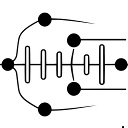

# tkm

This project implements spatiotemporal *k*-means, for points in real space.

## Installation
This package is entirely in python and uses poetry for managing the python virtual environment and dependencies.
 - have some python3 installed on your system
 - install `poetry`
 - run `poetry install`
